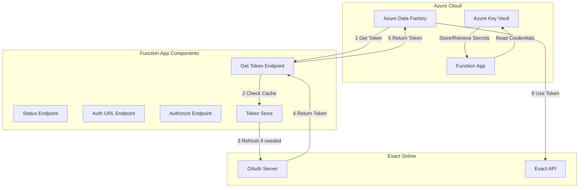
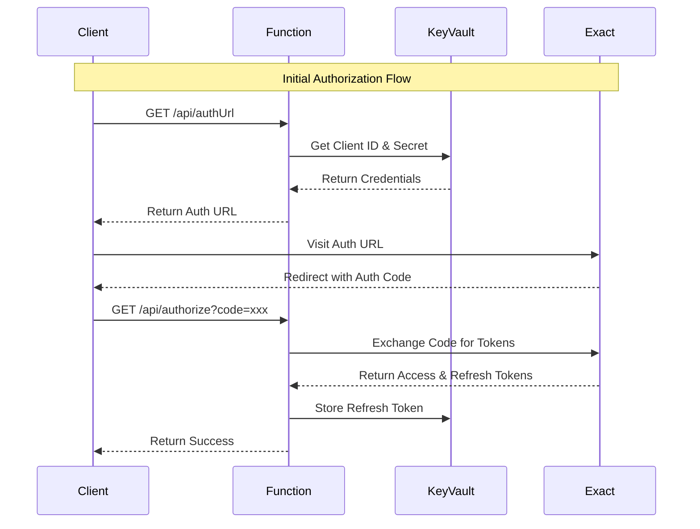
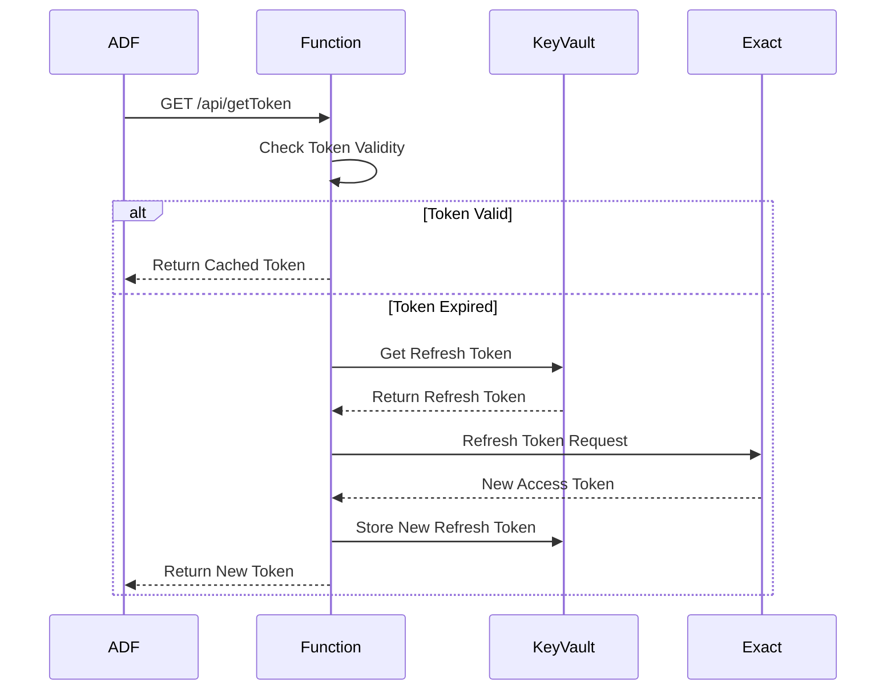
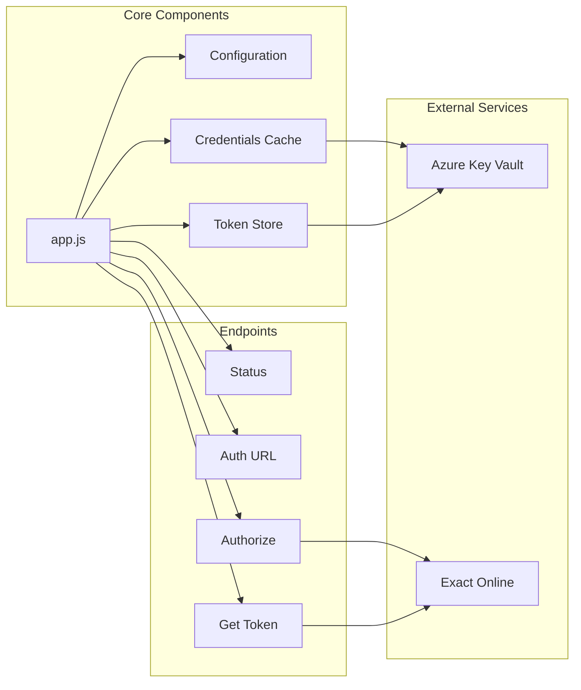
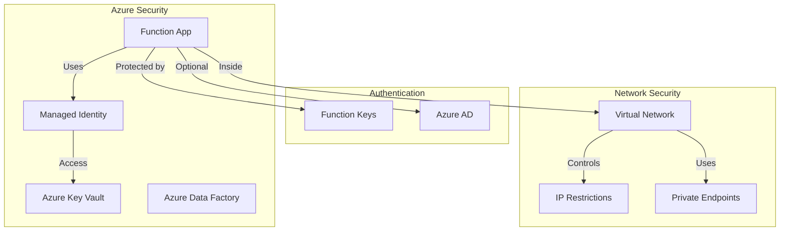

# Exact Online Authentication Gateway

A Node.js Azure Function that acts as an authentication gateway for Azure Data Factory to integrate with Exact Online's API, handling the complex OAuth 2.0 token management.

## Features

- **Centralized Token Management**: Handles all OAuth 2.0 complexity in one place
- **Automatic Token Refresh**: Respects Exact Online's 9.5-minute refresh interval
- **Azure Data Factory Ready**: Simple HTTP endpoints for token retrieval
- **Security Focused**: Refresh tokens never leave the service
- **Production Ready**: Error handling, logging, and health checks included
- **Azure Key Vault Integration**: Secure storage of credentials and tokens

## System Architecture

### High-Level Architecture


### Authentication Flow


### Token Refresh Flow


### Component Dependencies


### Security Architecture


## API Endpoints

### 1. Get Valid Access Token
**GET** `/api/getToken`
- Returns a valid access token for Exact Online API calls
- Automatically refreshes expired tokens
- Used by Azure Data Factory before API calls
- Requires function key authentication

```json
{
  "access_token": "eyJ...",
  "expires_at": 1640995200000,
  "status": "valid"
}
```

### 2. Initial Authorization
**GET/POST** `/api/authorize?code=AUTH_CODE`
- Exchanges authorization code for initial tokens
- Called once during setup process
- Requires function key authentication

### 3. Get Authorization URL
**GET** `/api/authUrl`
- Returns the URL for initial OAuth authorization
- Used during initial setup
- Requires function key authentication

### 4. Health Check
**GET** `/api/status`
- Service health and token status information
- No authentication required

## Setup Instructions

### 1. Exact Online App Registration

1. Log into Exact Online Developer Portal
2. Create a new application
3. Set redirect URI to: `https://your-function-app.azurewebsites.net/api/authorize`
4. Note down Client ID and Client Secret

### 2. Azure Key Vault Setup

1. Create a Key Vault in Azure Portal or using Azure CLI:
```bash
az keyvault create --name your-keyvault-name --resource-group your-resource-group --location "West Europe"
```

2. Add your Exact Online credentials as secrets:
```bash
az keyvault secret set --vault-name your-keyvault-name --name exact-client-id --value "your-client-id"
az keyvault secret set --vault-name your-keyvault-name --name exact-client-secret --value "your-client-secret"
az keyvault secret set --vault-name your-keyvault-name --name exact-redirect-uri --value "https://your-function-app.azurewebsites.net/api/authorize"
```

### 3. Deploy to Azure

#### Option A: Deploy via Azure Portal
1. Create a new Function App in Azure Portal
2. Choose Node.js 22 runtime
3. Upload the code or deploy from GitHub

#### Option B: Deploy via Azure CLI
```bash
# Create function app
az functionapp create --resource-group your-resource-group --consumption-plan-location "West Europe" --runtime node --runtime-version 22 --functions-version 4 --name your-function-app --storage-account your-storage-account --os-type Linux

# Enable system-assigned managed identity
az functionapp identity assign --name your-function-app --resource-group your-resource-group

# Grant Key Vault access to the function app
az keyvault set-policy --name your-keyvault-name --object-id <function-app-principal-id> --secret-permissions get list

# Configure app settings
az functionapp config appsettings set --name your-function-app --resource-group your-resource-group --settings "KEY_VAULT_URL=https://your-keyvault-name.vault.azure.net/" "EXACT_CLIENT_ID=@Microsoft.KeyVault(SecretUri=https://your-keyvault-name.vault.azure.net/secrets/exact-client-id)" "EXACT_CLIENT_SECRET=@Microsoft.KeyVault(SecretUri=https://your-keyvault-name.vault.azure.net/secrets/exact-client-secret)" "EXACT_REDIRECT_URI=@Microsoft.KeyVault(SecretUri=https://your-keyvault-name.vault.azure.net/secrets/exact-redirect-uri)"

# Deploy code
func azure functionapp publish your-function-app
```

### 4. Initial Authorization (One-time setup)

1. Get authorization URL:
   ```
   GET https://your-function-app.azurewebsites.net/api/authUrl?code=YOUR_FUNCTION_KEY
   ```

2. Visit the returned URL and authorize the application

3. You'll be redirected back with an authorization code, which automatically exchanges for tokens

## Azure Data Factory Integration

### Web Activity Configuration

In your ADF pipeline, add a **Web Activity** before calling Exact Online:

**Settings:**
- **URL**: `https://your-function-app.azurewebsites.net/api/getToken?code=YOUR_FUNCTION_KEY`
- **Method**: GET
- **Headers**: 
  ```json
  {
    "Content-Type": "application/json"
  }
  ```

**Output Variable**: `@activity('GetToken').output.access_token`

### Using the Token

In subsequent Web Activities calling Exact Online:

**Headers:**
```json
{
  "Authorization": "Bearer @{activity('GetToken').output.access_token}",
  "Content-Type": "application/json"
}
```

## Local Development

1. Install Azure Functions Core Tools
2. Clone this repository
3. Install dependencies: `npm install`
4. Create a `.env` file with your environment variables:
   ```
   KEY_VAULT_URL=https://your-keyvault-name.vault.azure.net/
   EXACT_TOKEN_URL=https://start.exactonline.nl/api/oauth2/token
   EXACT_AUTH_URL=https://start.exactonline.nl/api/oauth2/auth
   ```
5. Run locally: `npm start`

## Security Considerations

### Authentication Levels
- **Function Key**: Default for most endpoints (`authLevel: 'function'`)
  - Requires a function key in requests
  - Best for internal/trusted clients
  - Get keys via Azure Portal or CLI
- **Anonymous**: Used for public endpoints (`authLevel: 'anonymous'`)
  - No authentication required
  - Used for status endpoint
- **Azure AD**: Recommended for production
  - Enable in Azure Portal → Authentication
  - Configure allowed users/groups/apps

### Network Security
- Use Azure VNET integration
- Configure IP restrictions
- Enable private endpoints

### Key Vault Security
- Use RBAC for access control
- Enable soft-delete and purge protection
- Rotate secrets regularly
- Monitor access with Azure Monitor

### Monitoring and Logging
- Enable Application Insights
- Set up alerts for suspicious activity
- Monitor Key Vault access logs

## Troubleshooting

### Common Issues

1. **"No refresh token available"**
   - Need to complete initial authorization flow
   - Call `/api/authUrl` to get authorization URL

2. **"Cannot refresh token yet"**
   - Exact Online enforces 9.5-minute minimum between refreshes
   - Wait and retry

3. **"Failed to refresh token"**
   - Refresh token may be invalid
   - Re-run initial authorization process

4. **"401 Unauthorized"**
   - Missing or invalid function key
   - Add `?code=YOUR_FUNCTION_KEY` to URL or `x-functions-key` header

### Monitoring

Check Function App logs in Azure Portal:
- Monitor → Logs
- Application Insights → Live Metrics
- Key Vault → Monitoring → Logs

## Production Considerations

### Token Persistence
- Refresh tokens stored in Key Vault
- Access tokens cached in memory
- Automatic token refresh with 1-minute buffer

### High Availability
- Deploy across multiple regions
- Use Azure Front Door for load balancing
- Implement circuit breaker patterns

### Scaling
The function is stateless except for token storage. Consider external storage for horizontal scaling.

## License

MIT License - See LICENSE file for details