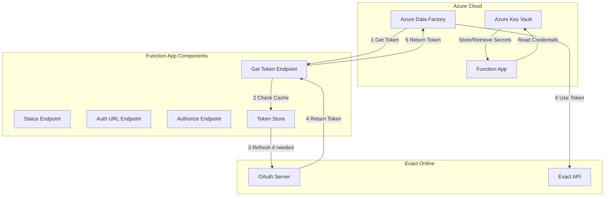
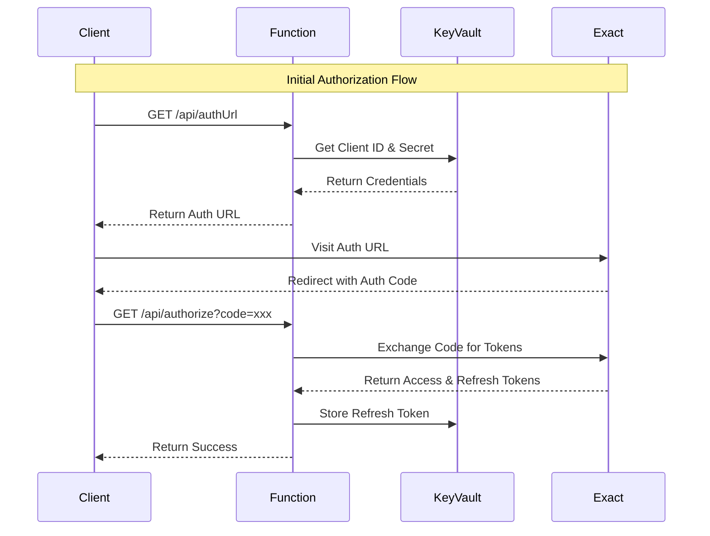
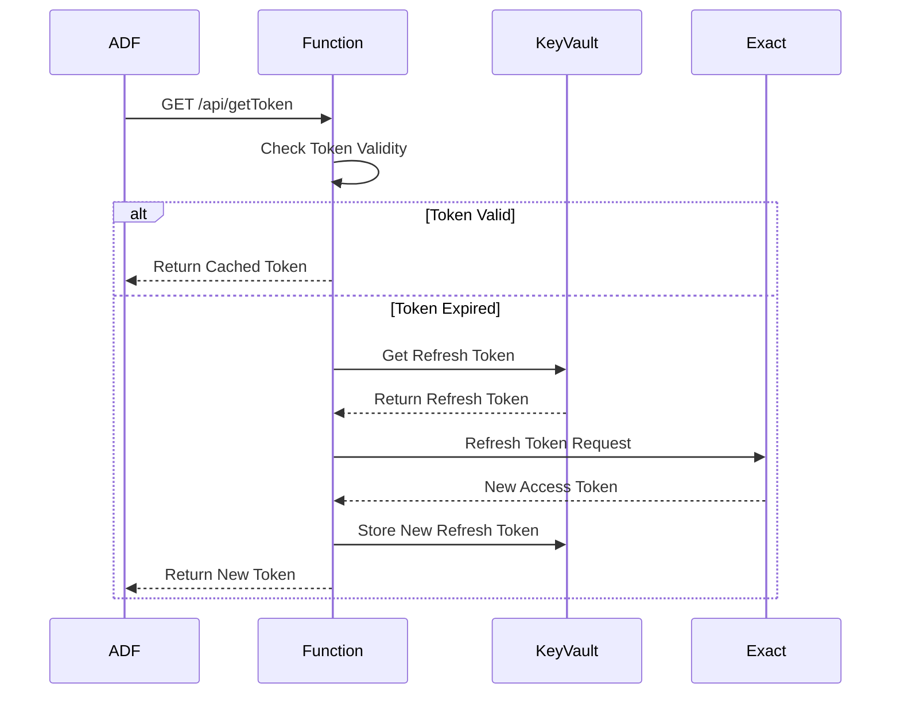
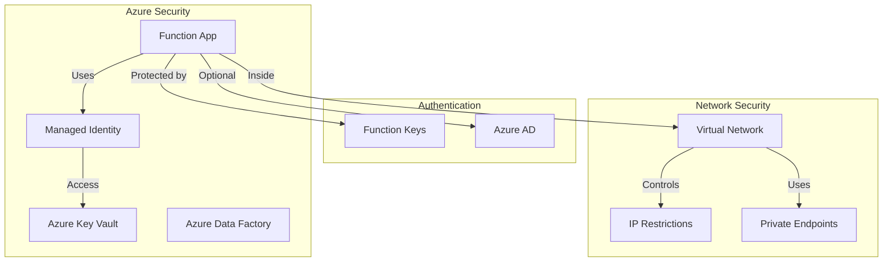

# Exact Online Authentication Gateway

A Node.js Azure Function that acts as an authentication gateway for Azure Data Factory to integrate with Exact Online's API, handling the complex OAuth 2.0 token management.

## Features

- **Centralized Token Management**: Handles all OAuth 2.0 complexity in one place
- **Automatic Token Refresh**: Respects Exact Online's 9.5-minute refresh interval
- **Azure Data Factory Ready**: Simple HTTP endpoints for token retrieval
- **Security Focused**: Refresh tokens never leave the service
- **Production Ready**: Error handling, logging, and health checks included
- **Azure Key Vault Integration**: Secure storage of credentials and tokens

## System Architecture

### High-Level Architecture
The following diagram illustrates the overall system architecture, showing how the Azure Function App acts as a central authentication gateway between Azure Data Factory and Exact Online. The Function App manages all OAuth 2.0 complexity, including token storage, refresh, and credential management through Azure Key Vault. This design ensures that sensitive credentials and tokens are securely stored and managed within Azure's security boundaries.



### Authentication Flow (one-time setup)
This sequence diagram details the initial authorization process. When a new integration is set up, the client must first obtain an authorization URL, which they use to grant access to their Exact Online account. The Function App then exchanges the authorization code for access and refresh tokens, storing the refresh token securely in Key Vault for future use. This is a one-time setup process that establishes the foundation for ongoing token management.



### Token Refresh Flow
The token refresh flow diagram shows how the system maintains continuous access to Exact Online's API. When Azure Data Factory needs to make an API call, it first requests a valid token from the Function App. The Function App checks if the current token is valid, and if not, it uses the stored refresh token to obtain a new access token. This process is transparent to the client and ensures uninterrupted access while respecting Exact Online's refresh token limitations.



### Component Dependencies
This diagram maps out the internal structure of the Function App, showing how different components interact with each other and external services. The core application logic is organized into distinct components for configuration management, token storage, and endpoint handling. Each component has specific responsibilities and dependencies, creating a modular and maintainable architecture.

```mermaid
graph LR
    subgraph Core Components
        App[app.js]
        Config[Configuration]
        TokenStore[Token Store]
        Credentials[Credentials Cache]
    end
    
    subgraph External Services
        KV[Azure Key Vault]
        EO[Exact Online]
    end
    
    subgraph API Endpoints
        Status[Status]
        AuthUrl[Auth URL]
        Authorize[Authorize]
        GetToken[Get Token]
    end
    
    App --> Config
    App --> TokenStore
    App --> Credentials
    App --> Status
    App --> AuthUrl
    App --> Authorize
    App --> GetToken
    
    Credentials --> KV
    TokenStore --> KV
    Authorize --> EO
    GetToken --> EO
```



### Security Architecture
The security architecture diagram outlines the multiple layers of security implemented in the system. From Azure Key Vault for secret management to network security controls and authentication mechanisms, each layer provides specific protection against different types of threats. This multi-layered approach ensures that sensitive data and operations are protected at every level of the application.



## API Endpoints

### 1. Get Valid Access Token
**GET** `/api/getToken`
- Returns a valid access token for Exact Online API calls
- Automatically refreshes expired tokens
- Used by Azure Data Factory before API calls
- Requires function key authentication

```json
{
  "access_token": "eyJ...",
  "expires_at": 1640995200000,
  "status": "valid"
}
```

### 2. Initial Authorization
**GET/POST** `/api/authorize?code=AUTH_CODE`
- Exchanges authorization code for initial tokens
- Called once during setup process
- Requires function key authentication

### 3. Get Authorization URL
**GET** `/api/authUrl`
- Returns the URL for initial OAuth authorization
- Used during initial setup
- Requires function key authentication

### 4. Health Check
**GET** `/api/status`
- Service health and token status information
- No authentication required

## Setup Instructions

### 1. Exact Online App Registration

1. Log into Exact Online Developer Portal
2. Create a new application
3. Set redirect URI to: `https://your-function-app.azurewebsites.net/api/authorize`
4. Note down Client ID and Client Secret

### 2. Azure Key Vault Setup

1. Create a Key Vault in Azure Portal or using Azure CLI:
```bash
az keyvault create --name your-keyvault-name --resource-group your-resource-group --location "West Europe"
```

2. Add your Exact Online credentials as secrets:
```bash
az keyvault secret set --vault-name your-keyvault-name --name exact-client-id --value "your-client-id"
az keyvault secret set --vault-name your-keyvault-name --name exact-client-secret --value "your-client-secret"
az keyvault secret set --vault-name your-keyvault-name --name exact-redirect-uri --value "https://your-function-app.azurewebsites.net/api/authorize"
```

### 3. Deploy to Azure

#### Option A: Deploy via Azure Portal
1. Create a new Function App in Azure Portal
2. Choose Node.js 22 runtime
3. Upload the code or deploy from GitHub

#### Option B: Deploy via Azure CLI
```bash
# Create function app
az functionapp create --resource-group your-resource-group --consumption-plan-location "West Europe" --runtime node --runtime-version 22 --functions-version 4 --name your-function-app --storage-account your-storage-account --os-type Linux

# Enable system-assigned managed identity
az functionapp identity assign --name your-function-app --resource-group your-resource-group

# Grant Key Vault access to the function app
az keyvault set-policy --name your-keyvault-name --object-id <function-app-principal-id> --secret-permissions get list

# Configure app settings
az functionapp config appsettings set --name your-function-app --resource-group your-resource-group --settings "KEY_VAULT_URL=https://your-keyvault-name.vault.azure.net/" "EXACT_CLIENT_ID=@Microsoft.KeyVault(SecretUri=https://your-keyvault-name.vault.azure.net/secrets/exact-client-id)" "EXACT_CLIENT_SECRET=@Microsoft.KeyVault(SecretUri=https://your-keyvault-name.vault.azure.net/secrets/exact-client-secret)" "EXACT_REDIRECT_URI=@Microsoft.KeyVault(SecretUri=https://your-keyvault-name.vault.azure.net/secrets/exact-redirect-uri)"

# Deploy code
func azure functionapp publish your-function-app
```

### 4. Initial Authorization (One-time setup)

1. Get authorization URL:
   ```
   GET https://your-function-app.azurewebsites.net/api/authUrl?code=YOUR_FUNCTION_KEY
   ```

2. Visit the returned URL and authorize the application

3. You'll be redirected back with an authorization code, which automatically exchanges for tokens

## Azure Data Factory Integration

### Web Activity Configuration

In your ADF pipeline, add a **Web Activity** before calling Exact Online:

**Settings:**
- **URL**: `https://your-function-app.azurewebsites.net/api/getToken?code=YOUR_FUNCTION_KEY`
- **Method**: GET
- **Headers**: 
  ```json
  {
    "Content-Type": "application/json"
  }
  ```

**Output Variable**: `@activity('GetToken').output.access_token`

### Using the Token

In subsequent Web Activities calling Exact Online:

**Headers:**
```json
{
  "Authorization": "Bearer @{activity('GetToken').output.access_token}",
  "Content-Type": "application/json"
}
```

## Testing with Postman

### Setting Up Postman Collection

1. **Create a new Postman Collection** named "Exact Online Auth Gateway"

2. **Add Collection Variables**:
   - `base_url`: Your function app URL (e.g., `https://gpconnect-auth.azurewebsites.net`)
   - `function_key`: Your function key from Azure Portal
   - `auth_code`: Will be populated after manual authorization

3. **Create the following requests**:

#### Request 1: Get Authorization URL
- **Method**: GET
- **URL**: `{{base_url}}/api/authUrl?code={{function_key}}`
- **Description**: Returns the Exact Online authorization URL

#### Request 2: Exchange Authorization Code
- **Method**: GET
- **URL**: `{{base_url}}/api/authorize?code={{auth_code}}`
- **Description**: Exchanges the authorization code for tokens (no function key needed)

#### Request 3: Get Access Token
- **Method**: GET
- **URL**: `{{base_url}}/api/getToken?code={{function_key}}`
- **Description**: Returns a valid access token for API calls

#### Request 4: Check Status
- **Method**: GET
- **URL**: `{{base_url}}/api/status`
- **Description**: Health check endpoint (no authentication required)

### Testing the Initial Authorization Flow

1. **Step 1 - Get Authorization URL**:
   - Run the "Get Authorization URL" request
   - Copy the `auth_url` from the response
   - Example response:
   ```json
   {
     "auth_url": "https://start.exactonline.nl/api/oauth2/auth?client_id=YOUR_CLIENT_ID&redirect_uri=https%3A%2F%2Fgpconnect-auth.azurewebsites.net%2Fapi%2Fauthorize&response_type=code",
     "instructions": "Visit this URL to authorize the application"
   }
   ```

2. **Step 2 - Manual Browser Authorization**:
   - Open the authorization URL in a browser
   - Log in to Exact Online
   - Grant permissions to your application
   - You'll be redirected to: `https://gpconnect-auth.azurewebsites.net/api/authorize?code=AUTHORIZATION_CODE`
   - Copy the authorization code from the URL

3. **Step 3 - Exchange Code for Tokens**:
   - Update the `auth_code` collection variable with the code from Step 2
   - Run the "Exchange Authorization Code" request
   - Example response:
   ```json
   {
     "message": "Authorization successful",
     "access_token": "eyJ...",
     "expires_in": 3600,
     "token_type": "Bearer"
   }
   ```

4. **Step 4 - Verify Setup**:
   - Run the "Check Status" request
   - Verify that `has_tokens` is `true`

### Testing Token Retrieval

After initial authorization, you can test token retrieval:

1. Run the "Get Access Token" request
2. The response will include a valid access token:
   ```json
   {
     "access_token": "eyJ...",
     "expires_at": 1704988800000,
     "status": "valid"
   }
   ```

### Tips for Postman Testing

1. **Authentication Options**:
   - Query parameter: `?code={{function_key}}`
   - Header: Add `x-functions-key` with value `{{function_key}}`

2. **Environment Setup**:
   - Create separate environments for local development and production
   - Local: `base_url` = `http://localhost:7071`
   - Production: `base_url` = `https://your-function-app.azurewebsites.net`

3. **Automated Testing**:
   - Add tests to validate response structure
   - Example test for token endpoint:
   ```javascript
   pm.test("Status code is 200", function () {
       pm.response.to.have.status(200);
   });
   
   pm.test("Response has access token", function () {
       const jsonData = pm.response.json();
       pm.expect(jsonData).to.have.property('access_token');
       pm.expect(jsonData.access_token).to.be.a('string');
   });
   ```

4. **Token Usage Example**:
   - Create a request to test the token with Exact Online API
   - Add authorization header: `Bearer {{access_token}}`
   - Store the token from "Get Access Token" response as a variable

## Local Development

1. Install Azure Functions Core Tools
2. Clone this repository
3. Install dependencies: `npm install`
4. Create a `.env` file with your environment variables:
   ```
   KEY_VAULT_URL=https://your-keyvault-name.vault.azure.net/
   EXACT_TOKEN_URL=https://start.exactonline.nl/api/oauth2/token
   EXACT_AUTH_URL=https://start.exactonline.nl/api/oauth2/auth
   ```
5. Run locally: `npm start`

## Security Considerations

### Authentication Levels
- **Function Key**: Default for most endpoints (`authLevel: 'function'`)
  - Requires a function key in requests
  - Best for internal/trusted clients
  - Get keys via Azure Portal or CLI
- **Anonymous**: Used for public endpoints (`authLevel: 'anonymous'`)
  - No authentication required
  - Used for status endpoint
- **Azure AD**: Recommended for production
  - Enable in Azure Portal → Authentication
  - Configure allowed users/groups/apps

### Network Security
- Use Azure VNET integration
- Configure IP restrictions
- Enable private endpoints

### Key Vault Security
- Use RBAC for access control
- Enable soft-delete and purge protection
- Rotate secrets regularly
- Monitor access with Azure Monitor

### Monitoring and Logging
- Enable Application Insights
- Set up alerts for suspicious activity
- Monitor Key Vault access logs

## Troubleshooting

### Common Issues

1. **"No refresh token available"**
   - Need to complete initial authorization flow
   - Call `/api/authUrl` to get authorization URL

2. **"Cannot refresh token yet"**
   - Exact Online enforces 9.5-minute minimum between refreshes
   - Wait and retry

3. **"Failed to refresh token"**
   - Refresh token may be invalid
   - Re-run initial authorization process

4. **"401 Unauthorized"**
   - Missing or invalid function key
   - Add `?code=YOUR_FUNCTION_KEY` to URL or `x-functions-key` header

5. **"No valid tokens available" despite completing authorization**
   - This usually indicates the refresh token couldn't be stored in Key Vault
   - Check if the Function App has proper Key Vault permissions
   - Verify the refresh token exists: `az keyvault secret show --vault-name your-keyvault --name exact-refresh-token`
   - If missing, the Function App likely lacks write permissions

### Key Vault Permission Issues

If tokens aren't persisting after authorization, the Function App may lack Key Vault permissions. This is a common issue when using RBAC-enabled Key Vaults.

#### Symptoms:
- Authorization succeeds but subsequent token requests fail
- Status endpoint shows `has_tokens: true` but getToken returns "Initial authorization required"
- Refresh token is missing from Key Vault

#### Solution:

1. **Check if refresh token exists in Key Vault**:
   ```bash
   az keyvault secret show --vault-name your-keyvault-name --name exact-refresh-token --query value -o tsv
   ```

2. **Get the Function App's managed identity**:
   ```bash
   az functionapp identity show --name your-function-app --resource-group your-resource-group --query principalId -o tsv
   ```

3. **Grant Key Vault permissions**:
   
   For RBAC-enabled Key Vaults:
   ```bash
   az role assignment create \
     --role "Key Vault Secrets Officer" \
     --assignee <managed-identity-id> \
     --scope /subscriptions/<subscription-id>/resourceGroups/<resource-group>/providers/Microsoft.KeyVault/vaults/<keyvault-name>
   ```
   
   For access policy Key Vaults:
   ```bash
   az keyvault set-policy \
     --name your-keyvault-name \
     --object-id <managed-identity-id> \
     --secret-permissions get list set
   ```

4. **Re-run the authorization flow** after fixing permissions

#### Verification:
- After authorization, verify the refresh token is stored: `az keyvault secret show --vault-name your-keyvault --name exact-refresh-token`
- The status endpoint should show valid tokens
- Subsequent getToken calls should succeed

### Monitoring

Check Function App logs in Azure Portal:
- Monitor → Logs
- Application Insights → Live Metrics
- Key Vault → Monitoring → Logs

#### Useful KQL Queries for Debugging

1. **View all function executions**:
   ```kql
   requests
   | where timestamp > ago(1h)
   | where cloud_RoleName == "your-function-app-name"
   | order by timestamp desc
   | project timestamp, name, resultCode, duration, success, url
   ```

2. **Check token refresh logs**:
   ```kql
   traces
   | where timestamp > ago(1h)
   | where cloud_RoleName == "your-function-app-name"
   | where message contains "refresh" or message contains "Token"
   | order by timestamp desc
   | project timestamp, message, severityLevel
   ```

3. **Find errors**:
   ```kql
   traces
   | where timestamp > ago(1h)
   | where cloud_RoleName == "your-function-app-name"
   | where severityLevel == "Error" or severityLevel == "Critical"
   | order by timestamp desc
   | project timestamp, message, severityLevel
   ```

## Production Considerations

### Token Persistence
- Refresh tokens stored in Key Vault
- Access tokens cached in memory
- Automatic token refresh with 1-minute buffer

### High Availability
- Deploy across multiple regions
- Use Azure Front Door for load balancing
- Implement circuit breaker patterns

### Scaling
The function is stateless except for token storage. Consider external storage for horizontal scaling.

## License

MIT License - See LICENSE file for details